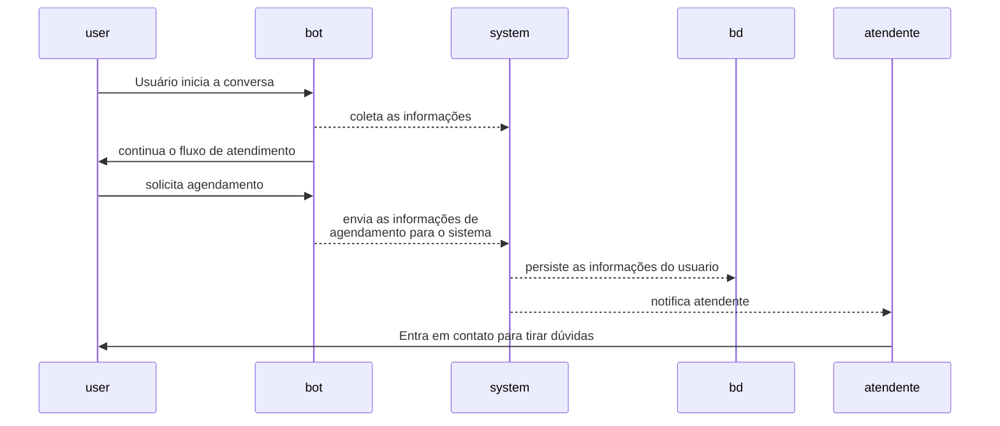

# 🤖 Chatbot WhatsApp - Assistente Virtual Automatizado


Um chatbot inteligente para WhatsApp que oferece atendimento automatizado com sistema de sessões e menu hierárquico.

## 📌 Índice

- [Funcionalidades](#-funcionalidades-principais)
- [Tecnologias](#-tecnologias-utilizadas)
- [Instalação](#-como-executar)
- [Configuração](#-configuração)
- [Uso](#-fluxo-de-atendimento)
- [Estrutura](#-estrutura-do-projeto)
- [Contribuição](#-como-contribuir)
- [Licença](#-licença)

## ✨ Funcionalidades Principais

- Atendimento automatizado por mensagens
- Sistema de sessões por usuário
- Menu interativo com múltiplos níveis
- Autenticação via QR Code web
- Avaliação de atendimento
- Redirecionamento para atendente humano

## 🛠️ Tecnologias Utilizadas

- Node.js v18+
- [Baileys](https://github.com/whiskeysockets/Baileys) (API WhatsApp)
- Express.js
- Pino (logging)
- QRCode Terminal

## 🚀 Como Executar

### Pré-requisitos

- Node.js 18+ instalado
- NPM ou Yarn
- Número do WhatsApp válido

### Instalação

```bash
git clone https://github.com/seu-usuario/chatbot-whatsapp.git
cd chatbot-whatsapp
npm install
npm run start
```

## Configuração

Crie um arquivo .env na raiz:

```bash
env
WHATSAPP_NUMBER=5511999999999
PORT=3000
```

Iniciar o Bot

```bash
npm start
Acesse http://localhost:3000 para escanear o QR Code
```

## 📋 Fluxo de Atendimento



## 🏗️ Estrutura do Projeto

```text
.
├── src/ 
│ ├── auth/ 
│ ├── handlers/ 
│ ├── utils/ 
│ └── app.js
├── .editorconfig
├── .env
├── .gitignore
├── .prettierignore
├── .prettierrc
├── package.json
├── package-lock.json
└── README.md
```

## 📄 Licença

© 2025 Nome da Sua Empresa ou Seu Nome

Este software é proprietário. Nenhuma parte deste código pode ser copiada, modificada, distribuída ou usada comercialmente sem permissão expressa do autor.

Todos os direitos reservados.

